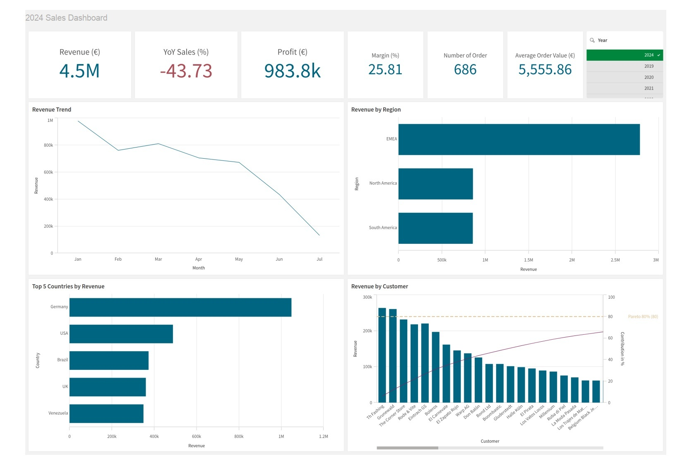

# 2024 Sales Dashboard

## 1. Project Overview
* **Goal:** To provide a centralized view of sales performance across customers, regions, and countries, helping stakeholders track KPIs and identify growth opportunities.
* **Tool:** Qlik Sense
* **Project Type:** Data modeling, Data analysis, Data visualization
* **Process:** Gathered multi-table sales data from Excel, built a star schema data model, created measures, and visualized data in Qlik Sense

## 2. Key Business Questions
This dashboard answers:
* What is the overall revenue, profit, margin, and YoY growth?
* How does monthly revenue trend across the year?
* Which regions and countries generate the highest revenue?
* Which customers drive 80% of total revenue (Pareto)?
* What is the average order value and order volume?

## 3. Qlik Sense Features

### a. Data Modeling
* Designed a star schema:
  * Fact table: Orders
  * Dimension tables: Customers, Products, Employees
* Linked tables via `CustomerID`, `EmployeeID` and `ProductID` enabling Qlik's associative model for cross-filtering across all dimensions

### b. Measures
```
Total Revenue     = Sum(Quantity * UnitPrice * (1 - Discount))
Number of Orders  = Count(DISTINCT OrderID)
AOV               = Sum(Quantity * UnitPrice * (1 - Discount)) / Count(DISTINCT OrderID)
Gross Profit      = Sum(Quantity * (UnitPrice * (1 - Discount) - UnitCost))
Gross Margin %    = Gross Profit / Total Revenue * 100
Cumulative %      = RangeSum(Above(Sum(...) / Sum(TOTAL ...) * 100, 0, RowNo(TOTAL)))
```


## 4. Key Insights of 2024 Performance

### a. Revenue Decline vs prior year
* 2024 revenue of €4.5M reflects a **-43.73% decline vs 2023**
* Margin stands at **25.81%** with gross profit of **€983.8k**

### b. Regional Performance
* EMEA is the dominant region, significantly outperforming North America and South America. Its revenue accounts for around 62% of total revenue
* Germany is the single largest country market with revenue over 1M€


## 5. Project Structure

| File / Folder | Description |
|---|---|
| `README.md` | Main project documentation |
| `Sales Dashboard.pdf` | Dashboard file |
| `SalesData_MultiTabs2024.xlsx` | Source data file |
